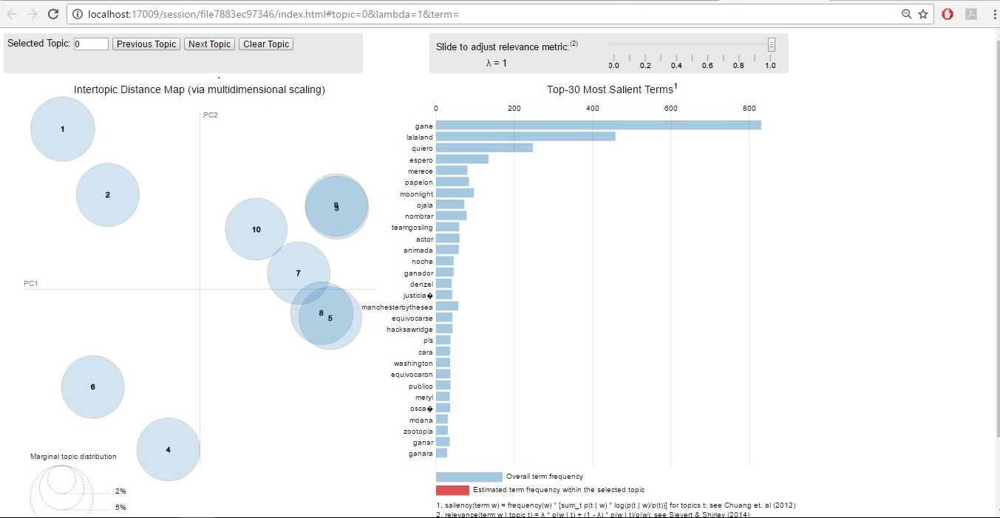

##- Antecedentes y motivación

###* Antecedentes

* **Big Data**

Denominamos Big Data a la gestión y análisis de enormes volúmenes de datos que no pueden ser tratados de manera convencional, ya que superan los límites y capacidades de las herramientas de software habitualmente utilizadas para la captura, gestión y procesamiento de datos.

Dicho concepto engloba infraestructuras, tecnologías y servicios que han sido creados para dar solución al procesamiento de enormes conjuntos de datos estructurados, no estructurados o semi-estructurados (mensajes en redes sociales, señales de móvil, archivos de audio, sensores, imágenes digitales, datos de formularios, emails, datos de encuestas, logs etc,) que pueden provenir de sensores, micrófonos, cámaras, escáneres médicos, imágenes.

* **Redes sociales**

Una red social es una estructura social compuesta por un conjunto de actores  que están relacionados de acuerdo a algún criterio (relación profesional, amistad, parentesco, etc.). Normalmente se representan simbolizando los actores como nodos y las relaciones como líneas que los unen. El tipo de conexión representable en una red social es una relación diádica o lazo interpersonal. 

Las investigaciones han mostrado que las redes sociales constituyen representaciones útiles en muchos niveles, desde las relaciones de parentesco hasta las relaciones de organizaciones a nivel estatal (se habla en este caso de redes políticas), desempeñando un papel crítico en la determinación de la agenda política y el grado en el cual los individuos o las organizaciones alcanzan sus objetivos o reciben influencias. La red social también puede ser utilizada para medir el capital social (es decir, el valor que un individuo obtiene de los recursos accesibles a través de su red social) y así una gran variedad de posibles estudios en las redes sociales.

* **Importancia de big data en las redes sociales**

En la actualidad, el análisis de las redes sociales se ha convertido en un método de estudio en ciencias como la antropología o la sociología. Internet y las nuevas tecnologías favorecen el desarrollo y ampliación de las redes sociales.

Las redes sociales son la mejor herramienta para obtener datos de investigación sobre los gustos y hábitos de los usuarios. Mientras que, hasta hace años, el análisis del comportamiento de los usuarios ha estado centrado en características demográficas como el sexo, la edad o el nivel de ingresos; hoy en día la clave para conocer a nuestros usuarios es investigar cómo se relacionan y cómo piensan.

En este contexto el Big Data facilita el análisis de las redes sociales, identificando por ejemplo, a los líderes de opinión de los temas relevantes (influenciadores) lo que nos permite la toma de decisiones según los comentarios de los clientes, quién los genera o los sigue y sus áreas de influencia en la red social. Además de encontrar a los influenciadores, en las redes sociales la gente habla de quiénes son y sobre lo que les gusta y lo que no.

* **Algunos proyectos previos**

    1. **Farmacovigilancia con twitter:** La industria Farmacéutica establece protocolos para la detección de efectos secundarios antes de que estos sean comercializados. Por otro lado, la Organización Mundial de la Salud (OMS) busca por medio de la implementación de programas de Farmacovigilancia, la detección, la evaluación y la prevención de los riesgos asociados a los medicamentos. [@6]
    
    2. **El proyecto SmartCityAlert (SCA):** Este proyecto tiene como objetivo crear una plataforma para clasificar, categorizar y monitorizar el estado de descontento sobre diferentes temáticas de una ciudad a partir de las opiniones de ciudadanos en Twitter en tiempo real. [@7]
    
    3. **Tourist Factory (UPC):** Tourist Factory es una solución AaaS (AnalyticsasaService) en tiempo real que, por una parte identifica turistas a las redes sociales en las grandes ciudades y, por otra parte, implementa un sistema de recomendaciones basado en contenido social y dirigido a estos turistas. [@8]
    
    4. **4.	Big data en la investigación lingüística. Evolución, análisis y predicción del uso de la lengua a través de twitter:** Esta tesis doctoral se inscribe en una línea de investigación relacionada con las nuevas tecnologías aplicadas a la Lingüística de Corpus y Big Data. Se pretende utilizar la información representada conceptualmente como Big Data (el producto tangible y no estructurado de las interrelaciones humanas a través de las nuevas tecnologías y de las redes sociales) para analizar el uso y la evolución del lenguaje. [@9]
    
    5. **TDC (Twitter Data Collection): Creación de una gran base de datos de Tweets:** La motivación de este proyecto es crear una base de datos flexible para adquirir, almacenar, analizar y consultar tweets. Se debe llevar a cabo un trabajo de investigación  sobre cuáles son las tecnologías usadas para este propósito y diseñar una arquitectura software acorde a ellas. Las investigaciones llevarán hacia el auge del Big Data. [@10]
    
###* Motivación

Recientemente Twitter se ha erigido como uno de los focos más importantes de información para el análisis de las redes sociales, tanto para la comprensión de cómo funcionamos como sociedad como para el estudio y predicción de eventos, de tendencias, de protestas y malestar social, de eventos que ocurren en la vida real en tiempo real, de temas en común entre muchos usuarios, entre otros.

Sin embargo, dichos estudios requieren de la obtención previa de grandes bases de datos que, dado el tamaño actual de Twitter, no son sencillos de adquirir. Por ello muchos de los mismos se basan en unos cuantos esfuerzos de recolección que se hicieron en el pasado o pequeñas compilaciones locales solo adecuadas para estudios concretos. 

No obstante, hoy en día se puede sacar provecho de las API’S de Twitter que son utilizadas en muchos lenguajes de programación, todo esto con el de objetivos recolectar una variedad de información para fines educativos, experimentos, investigaciones, etc.

##- Objetivos del proyecto

1. Encontrar la distribución de apoyo a las películas en la categoría de Mejor Película de los Premios Oscars 2017 en una muestra de usuarios de Twitter basados en sus tweets publicados en el mes de Febrero.

2. Lograr agrupar los diversos gustos de los usuarios basados en sus tweets y poder descubrir la proporción de usuarios que apoyaba cada película.

3. Hacer una comparación de las predicciones hechas por la crítica en la categoría de Mejor Película previas a los premios Oscars 2017 y los resultados obtenidos, para así así descubrir si existe alguna relación entre lo primero y los gustos expresados por los usuarios.

##- Preguntas Iniciales

-	¿Cuál es la distribución de apoyo a las películas en la categoría de Mejor Pelicula de los Premios Oscars en una muestra de usuarios en Twitter en sus tweets publicados en el período de Febrero?
-	¿La opinión de los usuarios correspondía con las críticas hechas previamente en la categoría de mejor pelicula por los expertos en la academia?

##- ¿Cómo estas preguntas evolucionaron a lo largo del curso?

A medida que se avanzaba en el proyecto y se exploraban los datos,  se fue conociendo su estructura y el alcance que de los mismos, asi como también los conocimientos que podía aportar, nos dimos cuenta que conseguir la distribución de apoyo no era una pregunta apta para responder y tampoco aportaría un conocimiento importante.

A partir de ahí se enfocó a responder la pregunta con respecto a los tópicos para identificar los temas más relevantes con respecto al tema del proyecto.

##- ¿Qué preguntas nuevas surgieron en el desarrollo de su análisis?

Una vez terminado el estudio, nos surgen preguntas como: 
-	¿Si se usa una muestra más grande los resultados serán los mismos o van a llegar a variar?
-	¿Que se pueden hacer con esos usuarios que tienen tendencia a apoyar varias películas?
-	¿Qué se pueden hacer con aquellos usuarios que apoyan el tema pero son completamente aislados de la opinión mayoritaria? ¿Se descartarían?
-	Si la API de Twitter permitiera poder obtener más tweets de una semana de anterioridad, ¿Lograríamos un mejor resultado con una muestra de mayor cantidad?

##Fuentes de Datos

Debido a que el proyecto se basa en el análisis de tweets de diferentes usuarios, la fuente de datos para obtener los tweets proviene de la red social “Twitter”, dicha información se extra a través de la API de twitter basado en un search que se realiza ejecutando un Query de búsqueda. 

Así de esta manera se obtienen todos los tweets basados en la preferencia que tienen los usuarios con las nominaciones de la Mejores Película de los Premios Oscars 2017

## Limpieza

En la fase de limpieza de los datos, se procedió a normalizar los datos obtenidos con el search de TwitterR, para tener consistencia y facilidad de uso. También se decidió cómo se van a tratar datos faltantes, atípicos o dudosos. Una posibilidad es tratarlos como un tipo de dato especial o bien se decide descartarlos. 

En nuestro caso, se analizó y se limpiaron  aquellos tweets que no nos aportaban lo suficiente información para tener los resultados correctos, eliminar palabras que no aporten información, crear tokens, tematización, entre otros.

La limpieza de los tweets fue una de las etapas más importantes y de mayor esfuerzo en el desarrollo de este proyecto, ya que unos datos que sean correctos darán un resultado con mejor confiabilidad.

El primer paso de la limpieza consiste en colocar los tweets en un Corpus para poder realizar todas las limpiezas necesarias a estos. En R el comando para hacer este paso es:

```{r}
#install.packages(c("tm","RColorBrewer","wordcloud","topicmodels","LDAvis","dplyr","stringi"))

library(tm)
library(wordcloud)
library(topicmodels)
library(LDAvis)
library(dplyr)
library(stringi)

tweets <- read.csv("tweetsOscars.csv", header = TRUE, sep = ",")

textT <- tweets$text

tweetCorpus <- Corpus(VectorSource(textT))
```

Donde en tweets ya teníamos almacenados los tweets de un document .csv guardado anteriormente.

Una vez que teníamos los tweets en esa estructura, se facilita el proceso de limpieza sobre esos datos. Lo que se busca con esta limpieza es lograr tener tweets con información relevante e importante y limpiar todos aquellos elementos que no nos generan información y no son relevantes para el estudio.

## ¿Qué métodos de limpieza de aplicaron?

1.	Se removieron los signos de puntuación de los tweets.
```{r}
tweetCorpus <- tm_map(tweetCorpus, removePunctuation) #remover signos de puntuacion
```

2.	Se removieron las direcciones URL de los tweets.
```{r}
removeURL <- function(x) gsub("http[[:alnum:]]*","", x) #remover los enlaces
tweetCorpus <- tm_map(tweetCorpus, content_transformer(removeURL))
```

3.	Se removieron los números de los tweets.
```{r}
tweetCorpus <- tm_map(tweetCorpus, removeNumbers) #remover las numeraciones
```

4.	Se convirtieron todos los tweets a minúscula.
```{r}
tweetCorpus <- tm_map(tweetCorpus, content_transformer(tolower)) #convertir en minuscula
```

5.	Se removieron las menciones de los usuarios en los tweets.
```{r}
removeMention <- function(x) gsub("@\\w+","", x) #quitar las menciones
tweetCorpus <- tm_map(tweetCorpus, content_transformer(removeMention))
```

6.	Se removieron los acentos de los tweets
```{r}
removeAccencts <- function(x) chartr("áéíóú", "aeiou", x) #remover los acentos
tweetCorpus <- tm_map(tweetCorpus, content_transformer(removeAccencts))
```

7.	Se concatenaron palabras como “lalaland”, “manchesterbysea”, “hacksaw ridge”, etc.  para normalizar los nombre de las películas y así aumentar la frecuencia de cada una.
```{r}
concatMovie1 <- function(x) gsub("la la land", "lalaland", x)
tweetCorpus <- tm_map(tweetCorpus, content_transformer(concatMovie1))

concatMovie2 <- function(x) gsub("hacksaw ridge", "hacksawridge", x)
tweetCorpus <- tm_map(tweetCorpus, content_transformer(concatMovie2))

concatMovie3 <- function(x) gsub("hell or high water", "hellorhighwater", x)
tweetCorpus <- tm_map(tweetCorpus, content_transformer(concatMovie3))

concatMovie4 <- function(x) gsub("hidden figures", "hiddenfigures", x)
tweetCorpus <- tm_map(tweetCorpus, content_transformer(concatMovie4))

concatMovie5 <- function(x) gsub("manchester by the sea", "manchesterbythesea", x)
tweetCorpus <- tm_map(tweetCorpus, content_transformer(concatMovie5))
```

8.Se realizó la correspondencia de pasar los nombres de las películas en español a inglés para obtener una mayor consistencia en los datos.
```{r}
translateMovie1 <- function(x) gsub("luz de luna", "moonlight", x)
tweetCorpus <- tm_map(tweetCorpus, content_transformer(translateMovie1))

translateMovie2 <- function(x) gsub("hasta el ultimo hombre", "hacksawridge", x)
tweetCorpus <- tm_map(tweetCorpus, content_transformer(translateMovie2))

translateMovie3 <- function(x) gsub("sin nada que perder", "hellorhighwater", x)
tweetCorpus <- tm_map(tweetCorpus, content_transformer(translateMovie3))

translateMovie4 <- function(x) gsub("figuras ocultas", "hiddenfigures", x)
tweetCorpus <- tm_map(tweetCorpus, content_transformer(translateMovie4))

translateMovie5 <- function(x) gsub("la llegada", "arrival", x)
tweetCorpus <- tm_map(tweetCorpus, content_transformer(translateMovie5))

translateMovie6 <- function(x) gsub("un camino a casa", "lion", x)
tweetCorpus <- tm_map(tweetCorpus, content_transformer(translateMovie6))

translateMovie7 <- function(x) gsub("manchester junto al mar", "manchesterbythesea", x)
tweetCorpus <- tm_map(tweetCorpus, content_transformer(translateMovie7))
```

9. Se remueven las stopwords 
```{r}
tweetCorpus <- tm_map(tweetCorpus, removeWords, stopwords("spanish")) #remueve los stopwords del paquete

myStopWords <- readLines("stopwords.txt",encoding="UTF-8") #remueve los stopwords personales
myStopWords <- iconv(myStopWords, to="ASCII//TRANSLIT")
tweetCorpus <- tm_map(tweetCorpus, removeWords,myStopWords)
```

9. Se removieron los espacios en blanco
```{r}
tweetCorpus <- tm_map(tweetCorpus, stripWhitespace) #quita los espacios en blanco
```


## Análisis exploratorio

### ¿Qué visualizaciones uso para obtener puntos de vista diferentes de los datos?

Se utilizó en principio la función wordcloud del paquete wordcloud para crear una nube de palabras y asi visualizar de una manera descriptiva y sencilla la frecuencia de las palabras y de esta manera hacer una análisis exploratorio de los mismos. Para esto en un principio hay que convertir el corpus (ya limpio) en un matriz de términos de documento. Luego transformar esa matriz en un dataframe y así poder hacer la nube.

```{r}
tdm <- TermDocumentMatrix(tweetCorpus)

toDataFrame <- function(tdm){
  #convierte a una matriz
  mat <- as.matrix(tdm)
  
  #conteo de palabras en orden decreciente
  count <- sort(rowSums(mat),decreasing=TRUE)
  
  #crea un data frame con las palabras y sus frecuencias
  df <- data.frame(word = names(count), freq=count)
  
  return(df)
}

dataF <- toDataFrame(tdm)

wordcloud(dataF$word, dataF$freq, min.freq = 5,random.order=FALSE, colors=brewer.pal(8, "Set2"))
```

La primera nube encontramos palabras muy frecuentes que no iban a aportar información al estudio tales como oscar, oscars, pelicula entre otras. Luego en el la segunda nube de palabras vemos que las palabras más frecuentes si pueden hacer un aporte significativo y se ve mayor distribución en las películas que es el tema importante. De esta forma se hizo una buena exploración de los datos

```{r}
#hay que eliminar las palabras que no generan informacion y son muy frecuentes
tweetCorpus <- tm_map(tweetCorpus, removeWords,c('oscars','oscar','pelicula','peliculas','eduaubcedubeuau','eduaubdedubuf','eduaubcedubeua','eduaubdedubud','eduaubdedubub','eduaubdedubu'))

tdm <- TermDocumentMatrix(tweetCorpus)

dataF <- toDataFrame(tdm)

wordcloud(dataF$word, dataF$freq, min.freq = 5,random.order=FALSE, colors=brewer.pal(8, "Set2"))
```


## ¿Qué métodos estadísticos consideró?

Primero se realizó una prueba previa en donde se estudiaron 4 tipos de modelos proporcionados por el paquete topicmodels para encontrar los diferentes tópicos en los datos obtenidos, los cuales fueron:
1. CTM, que realiza un Modelo de Tópico Correlacionado (Correlated Topic Model) utilizando como método un algoritmo VEM.
2. LDA con VEM, utiliza un modelo Asignación de Dirichlet latente (latent dirichlet allocation) utilizando el algoritmo de VEM. 
3. LDA con VEM ajustado, que es el mismo que el anterior, con la diferencia que el alfa (parámetro para el cálculo) no es estimado.
4. LDA con Gibbs, que utiliza el muestreo de Gibbs para el estimado. Los valores de los parámetros de entrada iter: número de iteraciones de Gibbs, burnin: número de iteraciones de Gibbs omitidas al principio y thin: número de iteraciones de Gibbs intermedias omitidas, fueron tomados como referencia de las páginas indicada por demostrar que son eficientes.

```{r}
##############################TOPIC MODEL####################################
dtm <- as.DocumentTermMatrix(tdm) #transformamos la matros documentos-terminos

SEED <- sample(1:10, 1)  # utilizamos un seed random
k <- 10 #numero de topicos


models <- list(
  CTM       = CTM(dtm, k = k, control = list(seed = SEED, var = list(tol = 10^-4), em = list(tol = 10^-3))),
  VEM       = LDA(dtm, k = k, control = list(seed = SEED)),
  VEM_Fixed = LDA(dtm, k = k, control = list(estimate.alpha = FALSE, seed = SEED)),
  Gibbs     = LDA(dtm, k = k, method = "Gibbs", control = list(seed = SEED, burnin = 1000,
                                                               thin = 100,    iter = 1000))
)


#se revisan los primeros 4 terminos por topico
lapply(models, terms, 4)
```

Luego de varias observaciones y análisis  subjetivos pudimos notar que el método de Gibbs es el más eficiente en este caso porque es el método que mejor representaba la distribución de los tópicos y de esta manera obtener un mejor resultado para analizar posteriormente.

```{r}
Gibbs <- LDA(dtm, k = k, method = "Gibbs", control = list(seed = SEED, burnin = 1000,thin = 100,    iter = 1000))
terms(Gibbs,4)
```

## Análisis Final
Luego de elegir el método de Gibbs, hacemos una vista general sobre los 4 temas más frecuentes en cada tópico, donde podemos hacer un análisis previo de cada tópico.

Las palabras frecuentes en los tópicos van a variar con respecto a la semilla, pero apesar de eso se puede ver que cada tópico mantiene un sentido y un conjunto de palabras similares y enfocados a unos mismos temas a pesar de que cambie la etiqueta en cada tópico, por lo que se puede asumir que la agrupación de los topicos la hace de manera similar

Usando el paquete LDavis pudimos hacer un gráfico para representar de manera visual estos tópicos

```{r}
topicmodels_json_ldavis <- function(fitted, corpus, doc_term){
  

  ## Find required quantities
  phi <- posterior(fitted)$terms %>% as.matrix
  theta <- posterior(fitted)$topics %>% as.matrix
  vocab <- colnames(phi)
  doc_length <- vector()
  for (i in 1:length(corpus)) {
    temp <- paste(corpus[[i]]$content, collapse = ' ')
    doc_length <- c(doc_length, stri_count(temp, regex = '\\S+'))
  }
  #temp_frequency <- inspect(dtm)
  #freq_matrix <- data.frame(ST = colnames(temp_frequency),
 #                           Freq = colSums(temp_frequency))
#  rm(temp_frequency)
  
  
  freq_matrix <- toDataFrame(doc_term)
  
  # Convert to json
  json_lda <- LDAvis::createJSON(phi = phi, theta = theta,
                                 vocab = vocab,
                                 doc.length = doc_length,
                                 term.frequency = freq_matrix$freq)
  
  return(json_lda)
}
##################################################################

#lda_json <- topicmodels_json_ldavis(Gibbs,tweetCorpus,tdm)
#serVis(lda_json)

#EL PAQUETE NO CORRE EN RMARKDOWN

```



Con este gráfico podemos ver que los tópicos se dividen en 3 secciones del plano en el izquierdo superior vemos los tópicos 1 y 2 que son los más aislados y los que hablan del error y los temas menos frecuentes. En la esquina inferior izquierda vemos los tópicos 4 y 6 los cuales hablan de las peliculas no tan habladas y los comentarios sobre los otros premios. El resto de los topicos se encuentran todos bastante juntos en la parte derecha, estos son los que hablan de las opiniones y se destacan las palabras gane, quiero, etc. es decir es donde los usuarios emiten sus opiniones sobre las peliculas que desean que ganen u otras categorías.

Algo que se pudo aprender de los datos, es que Lalaland fue una de las películas más habladas y comentadas en la noche, el error del la entrega del premio tambíen destacó mucho y que se puede ver que hubo una preferencia entre Denzel Whashington y Ryan Gosling como Mejor Actor, esto nos lleva a concluir que los comentarios de la noche estuvieron enfocados en estos tópicos antes mencionados. De esto podemos considerar que a pesar de las diferentes opiniones y los favoritismos los resultados pueden ser distintos y que Twitter es una muy buena fuente de datos para determinar tópicos y analizar su contenido.

